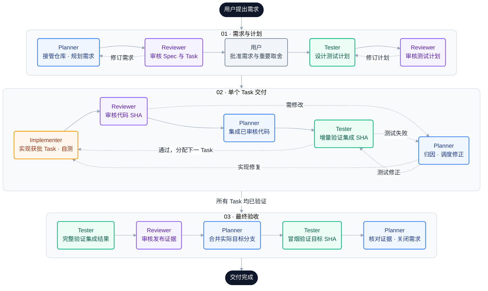

<div align="center">

# RIC DevFlow Skills

**把一次编码请求，升级成可审计、可接管、可交付的软件工程闭环。**

面向 Codex、Claude Code 和 ZCode 的共享四角色软件交付 Skill：规划、独立审核、独立测试和受控实现。


</div>

---

## 为什么是 DevFlow

普通 Agent 很擅长写代码，但复杂需求的真正难点往往不是“能不能写”，而是：

- 是否先弄清了既有仓库的真实入口、规则和历史包袱；
- 需求、测试、实现和审核是否绑定同一个版本与 Commit SHA；
- 谁可以修改什么，谁不能审核自己的工作；
- 环境、凭据或 live 服务缺失时，能否只阻塞受影响切片；
- 多轮审核是否会一次次释放新问题，导致成本和等待失控；
- 中途换 Agent 后，能否从持久证据恢复，而不是重新阅读整段对话。

RIC DevFlow Skills 把这些约束做成一套纯指令式工作流。它不增加新的 CLI、守护进程或状态机，而是让宿主 Agent 在使用目标仓库原有 Git、测试、CI 和发布工具时，遵循清晰的角色边界、G0–G10 门禁和不可变证据规则。

## 一眼看懂

**Planner 统一调度，Reviewer 独立把关，Tester 用证据验证，Implementer 在批准范围内实现。**

下图按「需求与计划 → 单个 Task 交付 → 最终验收」展开。同色节点代表同一角色，实线表示通过后推进，虚线表示退回或继续下一项 Task。箭头展示产物的推进顺序；所有角色动作都由同一个 Planner 调度，完成后向它回传结果。



> **如何读回路：** 审核不通过或测试失败时，先回到 Planner 归因，再交给负责的角色修正；新代码必须重新审核、重新验证。图中展开了常见的实现/测试返修；Spec、范围或测试计划中的预期/环境变化须复核受影响的批准，环境或授权缺失则记录 `BLOCKED` 和恢复条件。最终验收失败同样走这个回路，不能直接进入「交付完成」。门禁的适用范围与证据复用规则见[门禁策略](.agents/skills/_devflow_shared/contracts/gate-policy.md)。

| 角色 | 默认调用方式 | 核心职责 | 写入边界 |
|---|---|---|---|
| `devflow-planner` | 可隐式调用，也可显式调用 | 需求接收、仓库接管、Spec、Task DAG、状态、调度、归因、合并与关闭 | 规划/状态产物和已过门禁的 Git 协调；不写生产代码 |
| `devflow-reviewer` | 仅显式调用或由 Planner 委派 | 独立审核基线、Spec、测试计划、代码和发布证据 | 只读；只返回 `APPROVE`、`REQUEST_CHANGES` 或 `BLOCKED` |
| `devflow-tester` | 仅显式调用或由 Planner 委派 | 测试计划、特征测试、集成/E2E/回归验证、缺陷证据 | 只写测试及自身证据；不改生产代码 |
| `devflow-implementer` | 仅显式调用或由 Planner 委派 | 在一个已批准 Task 和变更预算内完成最小完整实现 | 只处理获批范围；不改 Spec、不自审、不合并 |

## 核心卖点

### 1. 优先支持已有项目的接手与迭代（Brownfield）

**Brownfield 指在已有项目上继续开发**：例如给现有系统加功能、修复线上问题，或接着别人做了一半的功能继续完成。只要已有代码、测试、接口约定、数据迁移或未提交改动，就需要先理解并保护这些现状；这个词并不只指老旧或质量差的项目。与之相对，Greenfield 指从零开始的新项目。

DevFlow 不假设项目从零开始。进入既有仓库时，它会先识别生效规则、真实目标分支、脏工作区、基线失败、相邻实现、契约和变更预算；续接半成品时，还会区分已接受、未验证、部分完成、Stub、冲突和未知工作。

### 2. 证据跟着版本和 SHA 走

Spec、用户批准、Review、Implementation Report 和 Test Report 都有明确身份。代码审核绑定精确的 `base_sha..head_sha`，测试绑定 `tested_sha`，发布审核绑定集成 SHA。分支名移动、行为变化或证据过期时，对应门禁会失效，而不是继续沿用一份“看起来通过”的旧结论。

### 3. 真正的职责隔离

Planner 不写生产代码，Reviewer 不修改被审核对象，Tester 不替 Implementer 修代码，Implementer 不改变需求也不合并。角色分离不是形式：它直接限制文件写入、批准权限和状态所有权。

### 4. 大需求先分期，再进入正式审核

首次 `SPEC_REVIEW` 前做有界预检；只有真实独立发布/验收边界才分期，同时保留完整能力清单。默认一个完整纵向 Task，接口、校验、测试与文档在 Task 内分步实现；文件多、步骤多或耗时长不自动增加任务。

### 固定 DAG，不递归启动研发流程

只有 Root Planner 调度角色；Implementer、Tester、Reviewer 不创建子任务或再次启动四角色流程。DAG 首次规划完成即作为送审基线，G2 通过后冻结；内部顺序、正常返修、上下文恢复和测试细化不改图。只有用户改变范围、已证实的依赖错误或无法在原 Task 内解决的安全/权限/环境/发布障碍，才记录依据并局部复审改图；不全图重建。

G0–G4 为当前 Root/阶段共享，不为每个步骤重走。内部步骤、不适用的额外基线专项、已由有效独立证据覆盖的重复审核可以直接省略；完整代码候选的 G5/G6 和最终验收仍保留。所谓“跳过审核”是少一次不必要的调用，不是替未审核代码写 APPROVE。详细规则见[门禁策略](.agents/skills/_devflow_shared/contracts/gate-policy.md)。

### 5. 更小的上下文，更快的恢复

角色交接只传 Root Issue、动作、精确产物路径/版本、适用 SHA、当前 Finding/Defect、允许与保护路径、输出和停止条件。完整材料从持久产物读取；平台支持时默认使用最小上下文继承，例如 `fork_turns: "none"`。

### 6. Reviewer 循环可收敛

Reviewer 必须在一轮中完成全部适用维度，并一次性返回当时可发现的全部 P0/P1/P2 Finding。窄修正优先由同一 Reviewer 做 Delta 复审；同一对象连续两次 `REQUEST_CHANGES` 仍未收敛时，Planner 先停下来归因，而不是继续制造新版本。

### 7. 不把 Mock 当成上线证明

测试计划明确区分合成/Mock、本地、集成、live 和生产验证。缺少凭据或环境时输出精确的 `BLOCKED` 证据；可以独立验收的切片单独阻塞，低权威结果不能冒充完整验收。

## 快速开始

### 前置条件

- 已安装支持 Skills 与原生子代理的 Codex、Claude Code 或 ZCode，按下面对应平台安装；配置可解析不等于已完成客户端运行验证；
- 本机有 Git；如使用下方 `gh repo clone` 命令，还需要已登录的 GitHub CLI；
- 如从私有仓库安装，当前 GitHub 身份必须拥有仓库读取权限；
- 目标项目仍应保留自己的 `AGENTS.md`、构建、测试、CI 和发布规则，DevFlow 会读取并映射它们，不会取代它们。

### 1. 获取仓库

```bash
gh repo clone lichong-a/ric-dev-workflow-skills
cd ric-dev-workflow-skills
```

也可以使用已配置凭据的 HTTPS 或 SSH：

```bash
git clone https://github.com/lichong-a/ric-dev-workflow-skills.git
```

### 2. 共享 Skill 用户级安装

把五个目录链接到用户级 Skill 目录。四个角色会被发现，`_devflow_shared` 只作为共享资源库，不会成为第五个 Skill。

```bash
DEVFLOW_SOURCE_DIR="$(pwd)"
mkdir -p "${HOME}/.agents/skills"

for skill_name in \
  devflow-planner \
  devflow-reviewer \
  devflow-tester \
  devflow-implementer \
  _devflow_shared
do
  source_path="${DEVFLOW_SOURCE_DIR}/.agents/skills/${skill_name}"
  target_path="${HOME}/.agents/skills/${skill_name}"

  if [ -e "${target_path}" ] || [ -L "${target_path}" ]; then
    printf '保留已有路径，请先人工核对：%s\n' "${target_path}"
  else
    ln -s "${source_path}" "${target_path}"
  fi
done
```

已有路径提示不是安装成功：先核对 `readlink -f` 和内容，确认四角色与 shared 来自同一个源树；失效链接或不同版本必须先解决，不能混用。后续平台安装前必须确认这一点。

### 3. Codex 原生配置（原方式不变）

安装 Custom Agent 配置。下面的命令不会覆盖同名文件；若提示已存在，请先使用 `diff -u` 审阅，再决定是否更新。

```bash
mkdir -p "${HOME}/.codex/agents"
cp --no-clobber .codex/agents/*.toml "${HOME}/.codex/agents/"
```

最后，把以下配置合并到 `${HOME}/.codex/config.toml`。如果已经存在 `[agents]` 段，请更新其中的键，不要重复追加同名 TOML 表。

```toml
[agents]
enabled = true
max_concurrent_threads_per_session = 6
```

仓库自带的推理强度配置偏向稳健交付：Planner 为 `max`、Reviewer 为 `high`、Tester 和 Implementer 为 `xhigh`；未硬编码具体模型，会沿用你的 Codex 模型配置。你可以按预算调整，但 Reviewer 建议至少保留 `high`，高风险变更不建议用低推理强度换速度。

> 符号链接依赖当前 clone 路径。移动或删除仓库前，应先更新用户目录中的链接。安装或更新后，建议重新启动 Codex 或新建任务，确保 Skills 与 Custom Agents 被重新加载。

#### Codex 仅在单个项目中使用

如果不希望全局启用，可以只把本仓库 `.agents/skills/` 中的五个目录复制或链接到目标项目的 `.agents/skills/`，并把 `.codex/agents/*.toml` 合并到目标项目的 `.codex/agents/`。再将 `[agents]` 配置合并到目标项目的 `.codex/config.toml`。

不要覆盖目标项目已有的 `.agents`、`.codex` 或 `AGENTS.md`；逐项合并并保留更具体的项目规则。DevFlow 的运行期证据会写入目标仓库的 `.devflow/changes/<REQ-ID>/`。

### 4. Claude Code 与 ZCode 原生配置

| 平台 | Skills | 四角色 agents | 注意事项 |
|---|---|---|---|
| Claude Code | 本仓库 .claude/skills → ../.agents/skills；用户级可逐目录链接 | 本仓库 .claude/agents；安装到目标 .claude/agents 或 ~/.claude/agents | skills 为复数；保留已有 CLAUDE.md/settings，不覆盖整个目录 |
| ZCode | 直接发现项目 .agents/skills 或 ~/.agents/skills，无需复制到 .zcode/skills | 本仓库 .zcode/agents 是四份配置源码；按官方支持安装到 ~/.zcode/agents | 仓库内文件存在不证明客户端已加载；当前不承诺项目级 agents 自动发现 |

以下是安装示例，不是工作流 CLI。先在本源码仓库根目录运行，选择一个平台及目标目录；ZCode 使用用户级目录。Claude 项目级安装可将目标改为目标仓库的 .claude，并先放齐该项目的共享五目录。每次安装预检全部目标，发现冲突即停止；只有同源且有效的符号链接可以重复执行。

```bash
DEVFLOW_SOURCE_DIR="$(pwd -P)"
DEVFLOW_HOST=claude
DEVFLOW_INSTALL_DIR="${HOME}/.claude"
# ZCode 改为：DEVFLOW_HOST=zcode；DEVFLOW_INSTALL_DIR="${HOME}/.zcode"
# Claude 项目级示例：DEVFLOW_INSTALL_DIR="/path/to/project/.claude"
(
  set -eu
  case "${DEVFLOW_HOST}" in claude|zcode) ;; *) exit 1 ;; esac
  devflow_sources=()
  devflow_targets=()
  for role in planner reviewer tester implementer; do
    devflow_sources+=("${DEVFLOW_SOURCE_DIR}/.${DEVFLOW_HOST}/agents/devflow-${role}.md")
    devflow_targets+=("${DEVFLOW_INSTALL_DIR}/agents/devflow-${role}.md")
  done
  if [ "${DEVFLOW_HOST}" = claude ]; then
    for entry in devflow-planner devflow-reviewer devflow-tester devflow-implementer _devflow_shared; do
      devflow_sources+=("${DEVFLOW_SOURCE_DIR}/.agents/skills/${entry}")
      devflow_targets+=("${DEVFLOW_INSTALL_DIR}/skills/${entry}")
    done
  fi
  for i in "${!devflow_sources[@]}"; do
    source_path="${devflow_sources[i]}"
    target_path="${devflow_targets[i]}"
    test -e "${source_path}"
    if [ -e "${target_path}" ] || [ -L "${target_path}" ]; then
      if [ -L "${target_path}" ] && [ -e "${target_path}" ] &&
         [ "$(readlink -f "${target_path}")" = "$(readlink -f "${source_path}")" ]; then
        continue
      fi
      printf '安装停止，保留冲突路径：%s\n' "${target_path}" >&2
      exit 1
    fi
  done
  for i in "${!devflow_sources[@]}"; do
    target_path="${devflow_targets[i]}"
    if [ ! -L "${target_path}" ]; then
      mkdir -p "$(dirname "${target_path}")"
      ln -s "${devflow_sources[i]}" "${target_path}"
    fi
  done
)
```

ZCode 的 Skill 来源可以是已安装的用户共享五目录或当前项目五目录，不要只链接 agents 而遗漏它们。独立调用时先确认客户端实际发现的 Skill 位置；原生定义直接读取该源树，不依赖其他平台配置。若由主会话交接，直接传入已解析的角色入口绝对路径和共享根。

更新源码后链接自动指向新内容；ZCode 代理定义修改后需新建会话，其他平台也建议新会话核对实际加载。移动源码前先记录并检查各链接目标，只修复明确属于本包的链接。卸载仅解除这次安装且已确认同源的逐个链接，不递归删除 .claude/.zcode/.agents，也不删除源树或其他平台仍使用的共享 Skills。

同名 Skill/Agent 的优先级由宿主决定：ZCode Skills 用户级在项目级之前、同级 .zcode 在 .agents 之前；Claude Skills 用户级也可遮蔽项目级，而原生 agents 有不同优先级。不要用“项目一定优先”推断生效版本。检查技能/代理列表中的来源、启用状态与新会话；无法确定时停止调用。不能假定 Claude/ZCode 执行 Codex 的 openai.yaml 调用策略；后三角色的显式边界同时写在描述和正文中，这是指令约束，不宣称为两平台硬性开关。

资料边界：ZCode 对 .agents/skills 的发现顺序来自随 3.11.2 安装包提供的 zcode-configuration-guide（静态文档事实）；在线 [ZCode Skill](https://zcode.z.ai/cn/docs/skill) 与 [子代理](https://zcode.z.ai/cn/docs/subagents)说明管理/加载方式。Claude 的目录、链接与代理字段见 [Skills](https://code.claude.com/docs/zh-CN/skills) 和 [sub-agents](https://code.claude.com/docs/zh-CN/sub-agents)。本包不采用 [动态 workflows](https://code.claude.com/docs/zh-CN/workflows)、Agent Teams 或脚本编排。当前实机验证范围以本包验证报告为准，未安装/未运行不能记为通过。

### 新平台如何调度

ZCode / Claude：主会话 → 四个平级子代理之一 → 主会话原样回传。Planner 决定下一角色并维护状态，主会话没有规划或正式证据写入权；四个子代理都不能再派生代理。主会话仅加载 Skill 不等于已经进入子代理，已启动的角色也不得再次调用自己。详见[原生平级调用](.agents/skills/devflow-planner/references/orchestration.md#原生平级调用)。

Planner/Tester/Implementer 默认继承模型、开放必要的读取/搜索/Bash/编辑；Reviewer 只开放 Read/Grep/Glob，无 Bash/MCP/编辑。工具白名单不是文件路径沙箱，不能等同 Codex Reviewer 的 read-only sandbox；写入角色仍须遵守 Task 允许/保护路径。Reviewer 通过[已核验的历史阅读缓存](.agents/skills/devflow-planner/references/orchestration.md#只读审核阅读缓存)读取 Git 原文，证据仍绑定原始 SHA；缺必要材料就 BLOCKED，不以工具受限省略审核。缺 MCP/环境须单独处理，不默认扩大权限。

## 怎么用

下方 $devflow-* 示例适用于 Codex/ZCode；Claude 使用 /devflow-*。原生角色也可通过宿主支持的显式入口选择；后三角色仍需精确对象，不因自动发现而允许普通请求隐式激活。

### 最常用：把开发请求交给 Planner

Planner 允许隐式调用。正常描述目标、约束和完成条件即可：

```text
请在当前项目增加订单导出能力，保持现有权限和 API 兼容；完成实现、测试和审核后交付。
```

也可以显式指定：

```text
使用 $devflow-planner 接管这个 Brownfield 需求。先核对仓库现状和既有流程，再完成分期、Spec、测试、实现与发布审核。
```

Planner 会先建立事实和证据，必要时才向你请求产品行为、敏感权限、生产操作或不可逆决策的确认。

### 独立审核

Reviewer 必须指定单一审核模式和精确对象：

```text
使用 $devflow-reviewer，以 CODE_REVIEW 模式审核 REQ-20260905-001 / TASK-003。
Spec 为 <文档完整 SHA> 中 .devflow/changes/REQ-20260905-001/current.md 的 SPEC 对象修订 2，
审核范围为 <base_sha>..<head_sha>，请一次性返回全部可发现的阻断 Finding。
```

支持的模式为 `BASELINE_REVIEW`、`SPEC_REVIEW`、`TEST_REVIEW`、`CODE_REVIEW` 和 `RELEASE_REVIEW`。

### 独立测试

```text
使用 $devflow-tester，为已批准的 Spec v2 创建测试计划。
请区分本地、集成和 live 验证边界，并把每条验收标准映射到稳定 Test Case ID。
```

### 单 Task 实现

```text
使用 $devflow-implementer，只实现 TASK-003。
严格遵守 Task 中的 base_sha、允许路径、保护路径、验收标准和变更预算；
完成后输出 Implementation Report，不要合并。
```

通常不需要手动逐个调用后三个角色；让 Planner 使用紧凑交接完成调度即可。显式调用更适合独立审计、测试补证或已经存在获批 Task 的场景。

## 四个文件，当前正文与完整历史分开

新 Root 按进度建立：
```text
.devflow/changes/<REQ-ID>/
├── state.yaml       # Planner：当前状态、有效证据和开放问题索引
├── current.md       # Planner：需求、画像、Spec、决策、预算、当前阶段 Task
├── test-plan.md     # Tester：AC、预期、环境和验证退出条件
├── evidence.md      # 各角色原始证据，只追加；Planner 原样转录
├── attachments/    # 必要脱敏证据、快照和一次性迁移索引
└── .local/         # 临时过程文件，不提交
```

current/test-plan 保持最新版，底部 Change Log 记录修订、时间、作者、类型、受影响 ID、原因和证据。每个 Task 独立修订，局部预算调整不复制其他 Task。历史正文留在 Git 的精确提交中；被拒绝版本也可恢复，Review/Test/Implementation 原始记录不能改写。G0–G10、独立 Reviewer/Tester 和用户批准保持不变。

调查默认一轮聚焦加一轮缺口补查，连续两次无新事实停止同类搜索。预算与依赖做局部技术复审，测试职责映射只查相应映射；行为、权限、契约、测试预期改变仍重开受影响门禁。对效率的实际验证与局限见[验证报告](docs/DEVFLOW_SKILLS_VALIDATION.md)，不承诺固定提速百分比。

### 哪些提交，什么时候提交？

业务仓库默认提交四核心文件与必要脱敏附件/迁移索引。失败、BLOCKED、未运行报告也是正式证据。Prompt、搜索/Diff 中间件、调试日志、临时报告、会话 ID/cursor/PID/缓存放 .local；凭据和未脱敏数据不进入受跟踪产物。

在业务仓库现有 .gitignore 中合并：
```gitignore
.devflow/changes/*/.local/
```

**不要复制本 Skill 源码仓库的 `.devflow/changes/` 排除规则**，它只为排除演示。ignore 不会移除已经跟踪的旧文件，先用 `git ls-files`、`git check-ignore -v --no-index <path>` 核对。

草稿连续编辑，不逐次提交；正式送审前固定相关文档，代码审核前固定完整候选，验收/状态切换时合并提交对应证据。精确路径暂存，不混入其他用户改动。哪些内容应提交与是否有 commit/push 授权是两回事，后者由宿主规则与用户决定。

文档身份是“完整 Commit SHA + 路径 + 对象 ID”；代码仍是 base/head/tested SHA。后续记账提交不冒充受测代码，也不要求文档保存自身 SHA。无 Git、不能跟踪或没有提交授权时，正式边界保存不可变持久快照，明确“仅本地可恢复”；缺少真实代码 SHA 的门禁仍阻塞。

### 旧版本文件如何无损合并？

Planner 发现 v1/spec-v*/tasks-v* 后，会给一次聚焦迁移建议；没有授权继续读旧布局，不自动删除。可以这样触发：

```text
使用 $devflow-planner 评估 REQ-... 的 v1 迁移，先列出完整源范围、
当前有效版本、未知内容及冲突。暂不切换或清理。
```

看过范围后，明确授权该 Root 的本地迁移、指定旧内容的基线提交/持久标签及核验后移除旧副本；推送须另有授权。迁移会保留全部 tracked/untracked/dirty 原文及未知字段，不能只挑最大版本。当前有效与开放问题所需原始证据进入账本，其余历史通过基线保留，逐文件来源记录在 `attachments/migration-v1.md`。

独立 Reviewer 批准精确候选、逐字恢复与语义核对通过后，最后切换 state，只移除索引中明确已保全的旧路径。未解决冲突、源变化、写入失败、未授权内容或只读仓库均不错误切换。过期产品批准/测试不会因迁移复活。

历史恢复命令（尖括号替换为迁移索引的真实值）：
```bash
git show <baseline-full-sha>:<old-path>
git show <doc-full-sha>:<current-path>
git fetch <remote> refs/tags/<actual-baseline-tag>:refs/tags/<actual-baseline-tag>
git rev-parse <actual-baseline-tag>^{commit}
```

基线标签通常为 `devflow-migration/<REQ-ID>/v1-baseline`，冲突时使用编号后缀、不覆盖旧标签。正常维护禁止删除/移动它。授权推送迁移时必须同时发布分支和实际基线标签，并从远端验证恢复；未推送记录“仅本地可用”。浅克隆需要补取标签；最新 ZIP 不保证包含旧原文。完整规则见[无损迁移参考](.agents/skills/_devflow_shared/references/legacy-migration.md)。

## 适用场景

特别适合：

- 已有代码、历史决策、脏工作区或半成品需要接管的 Brownfield 项目；
- 跨前后端、数据库、权限、基础设施或多个环境的功能；
- 对审计、兼容、证据、回滚和职责分离有要求的团队；
- 容易在多 Agent 协作中出现上下文膨胀、重复审核或范围漂移的任务；
- 希望保留 Codex 自主执行能力，同时让高风险动作受门禁约束的项目。

它不是所有任务都需要的仪式。纯解释、一次性文案、极小的无风险编辑或没有软件交付行为的请求，不应触发 Planner。DevFlow 也不会替代目标仓库自己的 CI、Issue 系统、发布审批或安全策略；语义等价的既有证据会被引用，而不是再维护一套竞争事实。

## 目录结构

```text
.
├── .agents/skills/
│   ├── devflow-planner/
│   ├── devflow-reviewer/
│   ├── devflow-tester/
│   ├── devflow-implementer/
│   └── _devflow_shared/
├── .codex/
│   ├── agents/
│   └── config.toml
├── .claude/
│   ├── skills -> ../.agents/skills
│   └── agents/                    # 四份 Markdown
├── .zcode/
│   └── agents/                    # 四份 Markdown
├── .devflow/README.md
└── docs/
    ├── DEVFLOW_SKILLS_DESIGN.md
    └── DEVFLOW_SKILLS_VALIDATION.md
```

- 四个 `SKILL.md` 是聚焦的角色入口；
- `_devflow_shared` 保存共享契约、模板、参考和场景评测，但没有 `SKILL.md`；
- `.codex/agents/` 定义 Custom Agent 的推理强度、Sandbox 和角色约束；
- .claude/agents 与 .zcode/agents 是各平台薄配置，四角色均存在；共享流程不复制；
- `.devflow/README.md` 说明目标项目中的运行期证据布局；
- `docs/` 保存完整设计与真实验证报告。

## 验证

静态检查、隔离 Git 迁移/恢复和独立角色评测的本轮实际结果统一记录在[验证报告](docs/DEVFLOW_SKILLS_VALIDATION.md)。历史 Brownfield 结果单独列出，不能当作本版重新执行的证明。

你可以在 clone 后重新运行基础验证：

```bash
VALIDATOR_PATH="${CODEX_HOME:-${HOME}/.codex}/skills/.system/skill-creator/scripts/quick_validate.py"

for skill_name in \
  devflow-planner \
  devflow-reviewer \
  devflow-tester \
  devflow-implementer
do
  python3 "${VALIDATOR_PATH}" ".agents/skills/${skill_name}"
done

codex --strict-config doctor --summary --no-color --ascii
```

完整设计见 [DevFlow Skills 总体设计](docs/DEVFLOW_SKILLS_DESIGN.md)，实际命令、结果和演示边界见 [验证报告](docs/DEVFLOW_SKILLS_VALIDATION.md)。

## 安全与兼容承诺

- 新容器使用 `schema_version: 2`，原 v1 模板/载荷/读取与门禁兼容，不强制迁移已有记录；
- 不硬编码目标分支、语言、框架、Issue 平台或具体模型；
- 不把 Token、Cookie、私钥、生产数据或未脱敏日志写入证据；
- 不用关闭规则、删除测试、无限重试或扩大超时制造假通过；
- 不自动进行生产发布、生产数据写入、付费操作或未授权的凭据访问；
- 不覆盖用户既有未提交修改，不用破坏性 Git 命令清理工作区。

## 当前状态

这是一个私有、纯指令式的三平台共享 Skill 包。本版保留 Codex 原配置，新增 Claude/ZCode 原生四角色定义，采用 Compact 四文件及按授权执行的无损迁移。它是指令规则，不是强制执行的状态机；配置适配与宿主实机验证分别记录，隔离演示不等于真实大项目的耗时基准。

如果你希望 Agent 不只是“交出代码”，而是交出一条可接管、复核和回滚的软件交付链路，这套 Skills 就是为此准备的。
